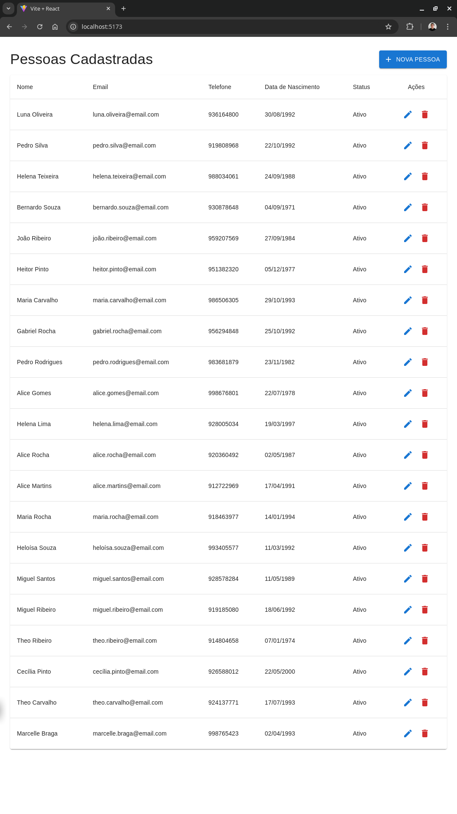
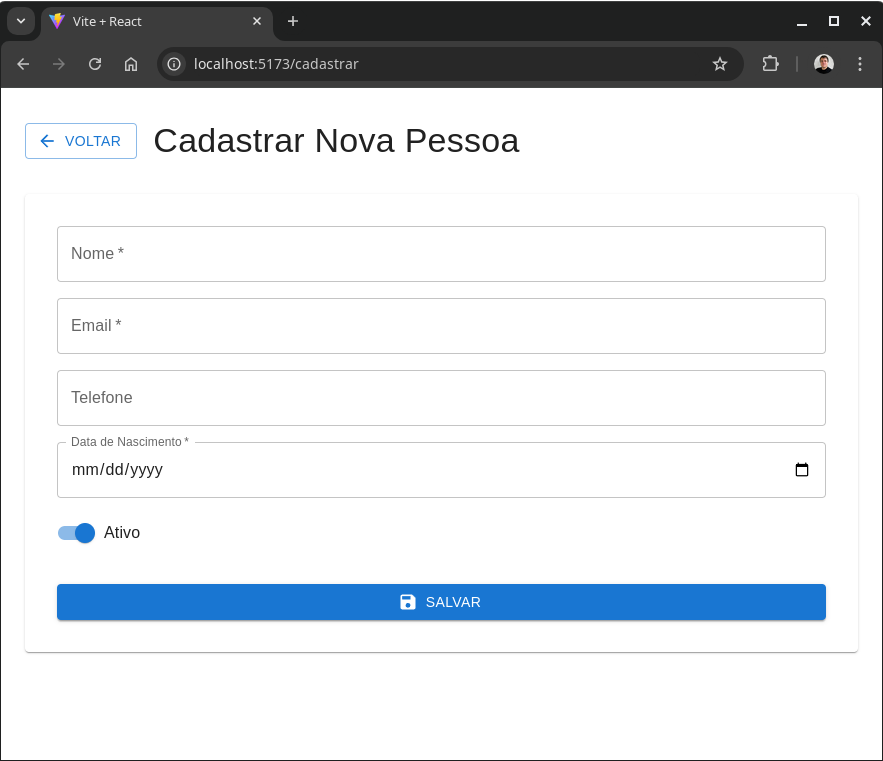
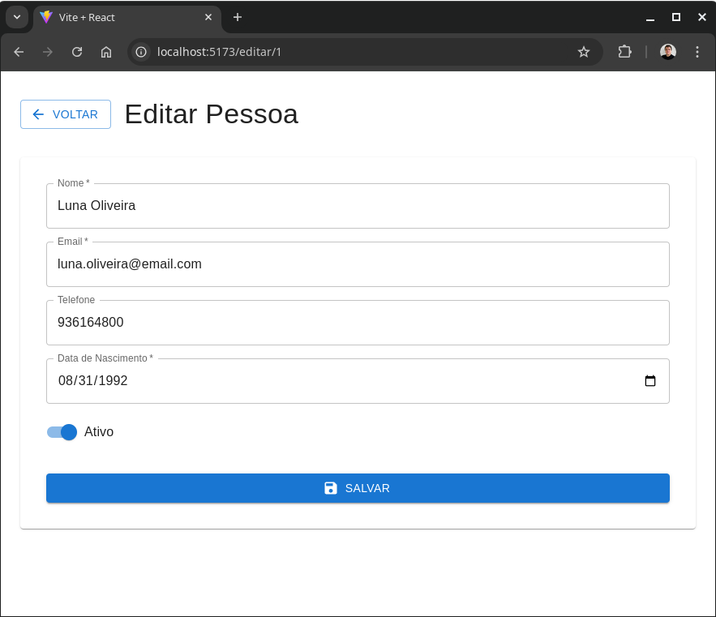
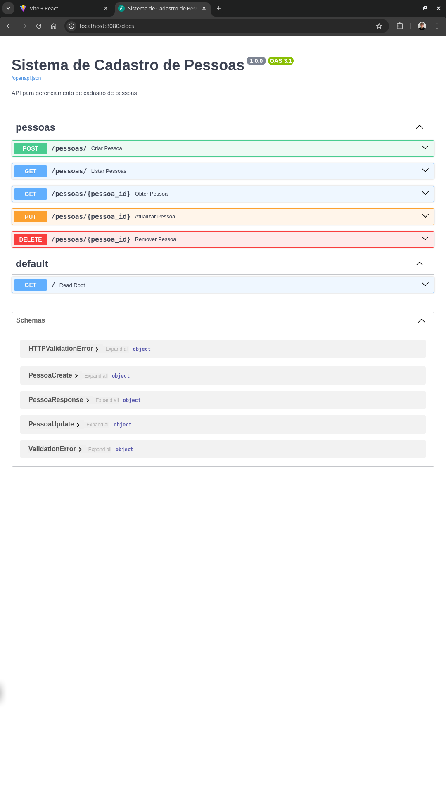

# Sistema de Cadastro de Pessoas

Sistema completo para gerenciamento de pessoas, com backend em FastAPI e frontend em React.

## 📸 Screenshots

<div align="center">

### 📋 Lista de Pessoas
*Visualização principal com tabela de registros e ações*


<br/>

### ✏️ Formulários
*Interface de cadastro e edição de registros*
<table>
  <tr>
    <td align="center" width="50%">
      <strong>Cadastro de Nova Pessoa</strong><br/>
      
    </td>
    <td align="center" width="50%">
      <strong>Edição de Registro</strong><br/>
      
    </td>
  </tr>
</table>

### 📚 Documentação da API
*Interface Swagger com todos os endpoints documentados*


</div>

## 📋 Visão Geral

O sistema permite gerenciar cadastros de pessoas com as seguintes funcionalidades:
- Listagem de pessoas
- Cadastro de nova pessoa
- Edição de dados
- Exclusão de registro
- Interface web moderna e responsiva

## 🚀 Tecnologias Utilizadas

### Backend
- Python 3.x
- FastAPI (Framework web)
- SQLite (Banco de dados)
- SQLAlchemy (ORM)
- Pydantic (Validação de dados)
- Uvicorn (Servidor ASGI)

### Frontend
- React 18
- Material-UI (MUI)
- React Router
- Axios
- Vite

## 🛠️ Estrutura do Projeto

```
CascadeProjects/
├── backend/           # API REST em FastAPI
│   ├── app/          # Código principal da aplicação
│   ├── scripts/      # Scripts utilitários
│   └── requirements.txt
│
└── frontend/         # Interface web em React
    ├── src/         # Código fonte
    ├── public/      # Arquivos públicos
    └── package.json
```

## 🚀 Como Executar

### Backend

1. Entre na pasta do backend:
```bash
cd backend
```

2. Instale as dependências:
```bash
pip install -r requirements.txt
```

3. Execute o servidor:
```bash
uvicorn app.main:app --reload --port 8080
```

### Frontend

1. Entre na pasta do frontend:
```bash
cd frontend
```

2. Instale as dependências:
```bash
npm install
```

3. Execute o servidor de desenvolvimento:
```bash
npm run dev
```

## 📱 Acessando o Sistema

- Frontend: http://localhost:5173
- API Docs: http://localhost:8080/docs
- ReDoc: http://localhost:8080/redoc

## 🔍 Funcionalidades Principais

1. Gerenciamento de Pessoas
   - Cadastro com nome, email, telefone, data de nascimento
   - Status ativo/inativo
   - Validação de dados
   - Interface intuitiva

2. Listagem
   - Tabela com todas as informações
   - Ações de editar e excluir
   - Formatação adequada de datas

3. Formulários
   - Campos validados
   - Feedback de erros
   - Navegação intuitiva
